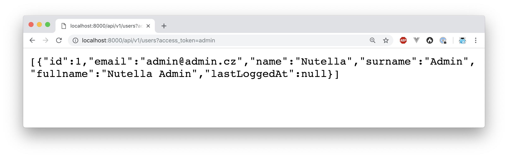
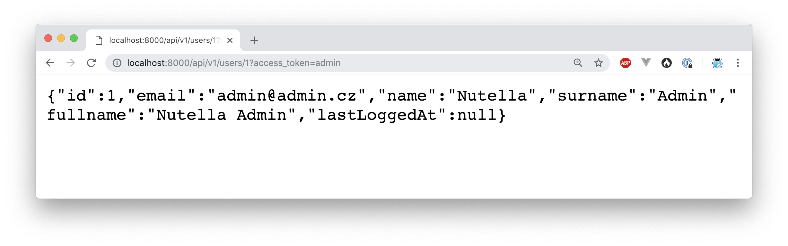
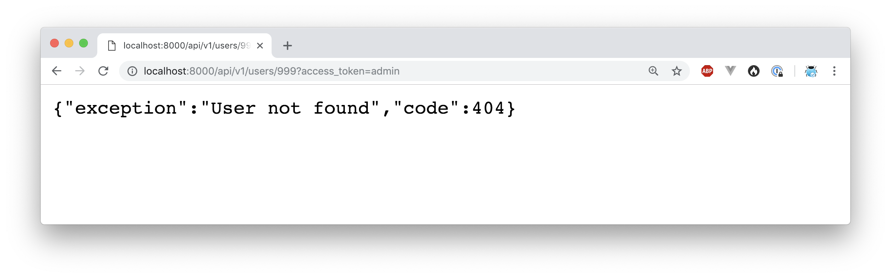

# Forest Project

**Forest project** is an example project based on Nette Framework and many useful packages by [@f3l1x](https://github.com/f3l1x).

Why **forest**? Because we are building (fo)REST API.

## Goal

Main goal is to provide best prepared API starter-kit project for Nette-Apitte developers.

Focused on:

- `nette/*` packages
- Doctrine ORM via `nettrine/*`
- Symfony components via `contributte/*`
- codestyle checking via **CodeSniffer** and `ninjify/*`
- static analysing via **phpstan**
- unit / integration tests via **Nette Tester** and `ninjify/*`

## Install

1) At first, use composer to install this project.

    ```
    composer create-project planette/forest-project
    ```

2) After that, you have to setup Postgres >= 10 database. You can start it manually or use docker image `postgres:10`.
     
    ```
    docker run -it -p 5432:5432 -e POSTGRES_PASSWORD=forest -e POSTGRES_USER=forest postgres:10
    ```
    
    Or use make task, `make loc-postgres`.

3) Custom configuration file is located at `app/config/config.local.neon`. Edit him if you want.

    Default configuration should looks like:

    ```yaml
    # Host Config
    parameters:
    
        # Database
        database:
            host: localhost
            dbname: forest
            user: forest
            password: forest
    ```

4) Database is running, application is configure to connect to it. Create initial data.

    Run `NETTE_DEBUG=1 bin/console migrations:migrate` to create tables.
    Run `NETTE_DEBUG=1 bin/console doctrine:fixtures:load --append` to create first user(s).

5) Start your devstack or use PHP local development server.

    PHP server is started by `php -S localhost:8000 -t www` or use prepared make task `make loc-web`.

6) Open http://localhost and enjoy it!

    Take a look at: 
    - [GET] http://localhost:8000/api/public/v1/openapi/meta (Swagger format)
    - [GET] http://localhost:8000/api/v1/users
    - [GET] http://localhost:8000/api/v1/users?_access_token=admin
    - [GET] http://localhost:8000/api/v1/users/1?_access_token=admin
    - [GET] http://localhost:8000/api/v1/users/999?_access_token=admin
    - [GET] http://localhost:8000/api/v1/users/email?email=admin@admin.cz&_access_token=admin
    - [POST] http://localhost:8000/api/v1/users/create

## Features

Here is a list of all features you can find in this project.

- :package: Packages
    - Nette 2.4
    - Apitte
    - Contributte
    - Nettrine
- :deciduous_tree: Structure
    - `app`
        - `config` - configuration files
            - `env` - prod/dev/test environments
            - `app` - application configs
            - `ext` - extensions configs
            - `config.local.neon` - local runtime config
            - `config.local.neon.dist` - template for local config
        - `domain` - business logic and domain specific classes
        - `model` - application backbone
        - `module` - API module
        - `resources` - static content for mails and others
        - `bootstrap.php` - Nette entrypoint
    - `bin` - console entrypoint (`bin/console`)
    - `db` - database files
        - `fixtures` - PHP fixtures
        - `migrations` - migrations files
    - `docs` - documentation
    - `log` - runtime and error logs
    - `temp` - temp files and cache
    - `tests` - test engine and many cases
        - `tests/cases/E2E` - PhpStorm's requests files (`api.http`)
        - `tests/cases/Integration`
        - `tests/cases/Unit`
    - `vendor` - composer's folder
    - `www` - public content
- :exclamation: Tracy
    - Cool error 500 page

### Composer packages

Take a detail look :eyes: at each single package.

- [contributte/bootstrap](https://contributte.org/packages/contributte/bootstrap.html)
- [contributte/di](https://contributte.org/packages/contributte/di.html)
- [contributte/http](https://contributte.org/packages/contributte/http.html)
- [contributte/security](https://contributte.org/packages/contributte/security.html)
- [contributte/utils](https://contributte.org/packages/contributte/utils.html)
- [contributte/tracy](https://contributte.org/packages/contributte/tracy.html)
- [contributte/console](https://contributte.org/packages/contributte/console.html)
- [contributte/neonizer](https://contributte.org/packages/contributte/neonizer.html)
- [contributte/monolog](https://contributte.org/packages/contributte/monolog.html)

**Apitte**

- [apitte/core](https://contributte.org/packages/apitte/core.html)
- [apitte/debug](https://contributte.org/packages/apitte/debug.html)
- [apitte/middlewares](https://contributte.org/packages/apitte/middlewares.html)
- [apitte/openapi](https://contributte.org/packages/apitte/openapi.html)

**Nettrine**

- [nettrine/orm](https://contributte.org/packages/nettrine/orm.html)
- [nettrine/dbal](https://contributte.org/packages/nettrine/dbal.html)
- [nettrine/migrations](https://contributte.org/packages/nettrine/migrations.html)
- [nettrine/fixtures](https://contributte.org/packages/nettrine/fixtures.html)
- [nettrine/extensions](https://contributte.org/packages/nettrine/extensions.html)

**Nette**

- [nette/finder](https://github.com/nette/finder)
- [nette/robot-loader](https://github.com/nette/robot-loader)

**Symfony**

- [symfony/serializer](https://github.com/symfony/serializer)
- [symfony/validator](https://github.com/symfony/validator)

## Demo




